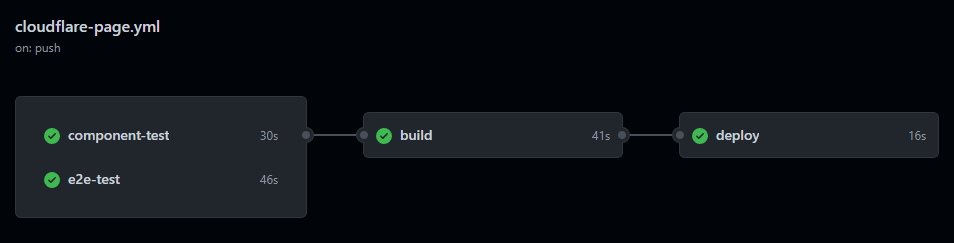

### Profolio of Cheng Tak Kin (with Nuxt3)
## I build something like this
---

### Install the dependencies:

```bash
npm install
```

### Start a development server
```bash
npm run dev
```

### Run component tests (Vitest)
```bash
npm run test:component
```

### Run e2e tests (Cypress)
```bash
npm run test:e2e
```
---
## CI/CD
Deployed to [Cloudflare Pages](https://chengtakkin.pages.dev) using Github Actions.




See the [pipeline](.github/workflows/cloudflare-page.yml).